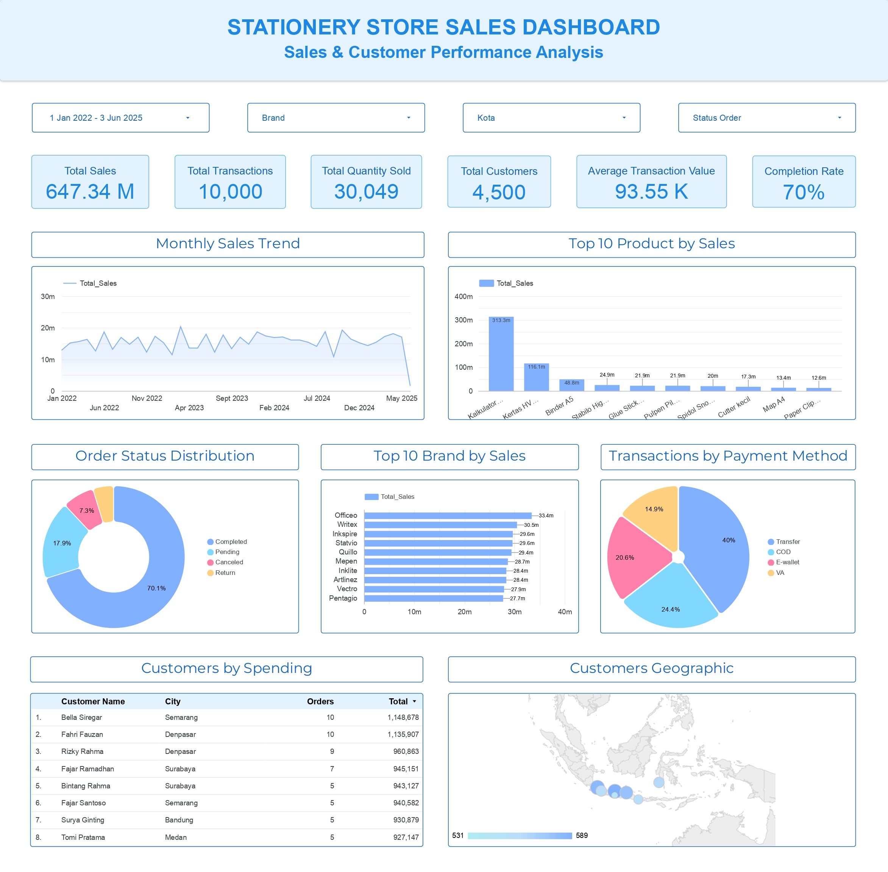

# Stationery Store Sales Analysis

---

## 1. Project Overview

Project ini merupakan salah satu project yang saya kerjakan selama mengikuti **Karirnex Bootcamp** pada bidang Data Analytics. Project ini bertujuan untuk menganalisis data transaksi sebuah toko alat tulis dari berbagai perspektif, mulai dari performa penjualan, produk dan brand, customer, lokasi customer, metode pembayaran, hingga status transaksi.

Proses analisis dilakukan menggunakan **MySQL** untuk data processing dan exploratory data analysis (EDA), kemudian hasil analisis divisualisasikan melalui **Looker Studio** dalam bentuk interactive dashboard. Project ini dibuat untuk menghasilkan insight yang dapat membantu memahami kondisi bisnis serta mendukung pengambilan keputusan berdasarkan data.

---

## 2. Project Objectives

Tujuan utama dari project ini adalah:

- Menganalisis performa penjualan secara keseluruhan.
- Mengidentifikasi tren penjualan berdasarkan waktu.
- Mengetahui produk dengan kontribusi sales terbesar.
- Menganalisis performa masing-masing brand.
- Mengidentifikasi customer dengan spending tertinggi.
- Menganalisis distribusi customer berdasarkan kota.
- Mengetahui distribusi transaksi berdasarkan status order.
- Menganalisis preferensi metode pembayaran customer.
- Membuat interactive dashboard untuk memvisualisasikan hasil analisis.
- Menghasilkan business insights dan recommendations berdasarkan data.

---

## 3. Business Questions

Beberapa business questions yang ingin dijawab melalui analisis ini adalah:

### Sales Performance
1. Berapa total sales, jumlah transaksi, quantity terjual, jumlah customer, dan average transaction value selama periode analisis?
2. Bagaimana perkembangan sales dari bulan ke bulan?
3. Bulan apa yang memiliki sales tertinggi?

### Product Performance
4. Produk apa yang memiliki sales tertinggi?
5. Brand apa yang memiliki sales tertinggi?
6. Bagaimana perbandingan sales antar-brand?

### Customer Analysis
7. Siapa saja customer dengan total spending tertinggi?
8. Bagaimana persebaran customer berdasarkan kota?
9. Kota mana yang memiliki jumlah customer terbanyak?

### Transaction Analysis
10. Bagaimana distribusi transaksi berdasarkan status order?
11. Berapa persentase transaksi yang berhasil diselesaikan (Completed)?
12. Metode pembayaran apa yang paling banyak digunakan customer?

---

## 4. Dataset Overview

Dataset yang digunakan merupakan dataset transaksi toko alat tulis dalam format Excel.

Data dianalisis menggunakan beberapa tabel yang saling berhubungan, antara lain:

- `transactions` — berisi data transaksi dan informasi penjualan.
- `customer` — berisi informasi customer dan kota.
- `status` — berisi status order.
- `payment` — berisi metode pembayaran.

### Periode Data

Periode transaksi yang dianalisis:

**1 Januari 2022 – 3 Juni 2025**

### Dataset Summary

Berdasarkan dashboard final:

| Metric | Value |
|---|---:|
| Total Sales | Rp647.34 juta |
| Total Transactions | 10,000 |
| Total Quantity Sold | 30,049 |
| Total Customers | 4,500 |
| Average Transaction Value | Rp93.55 ribu |
| Completion Rate | 70.1% |

---

## 5. Tools & Technologies

Tools yang digunakan dalam project ini:

Microsoft Excel — Data preparation dan initial data validation
MySQL — Data processing dan SQL analysis
MySQL Workbench — SQL query development
Looker Studio — Interactive dashboard development
GitHub — Project documentation dan version control

---

## 6. Data Preparation & Cleaning

Sebelum melakukan analisis, dilakukan proses data preparation untuk memastikan data siap digunakan untuk analisis SQL dan dashboard.

### 1. Data Validation

Dilakukan pengecekan terhadap struktur dan nilai pada dataset untuk memastikan setiap kolom dapat digunakan sesuai dengan kebutuhan analisis.

### 2. Shipping Cost Validation

Nilai `Biaya_Ongkir = 0` dipertahankan karena nilai tersebut dapat merepresentasikan transaksi dengan **free shipping**.

Nilai 0 pada biaya ongkir tidak dianggap sebagai missing value atau error.

### 3. Grand Total Correction

Kolom `Grand_Total` diperbaiki agar mengikuti formula:

Grand Total = Total Sales + Biaya Ongkir

Perbaikan dilakukan untuk memastikan nilai total transaksi dapat digunakan secara konsisten dalam analisis.

### 4. Clean Dataset

Setelah proses pengecekan dan perbaikan selesai, clean dataset digunakan sebagai sumber data untuk proses SQL analysis dan dashboard development.

---

## 7. SQL Analysis & EDA

Setelah proses data cleaning selesai, dataset di-import ke MySQL untuk dilakukan exploratory data analysis (EDA) menggunakan SQL.

Sebanyak 16 SQL analysis queries digunakan untuk mengeksplorasi performa bisnis dari berbagai perspektif.

### 1. Overall Sales Performance

Menganalisis performa penjualan secara keseluruhan berdasarkan:

Total Transactions
Total Quantity Sold
Total Sales
Total Discount
Total Shipping Cost
Total Grand Total
Average Order Value

### 2. Monthly Sales Performance

Menganalisis perkembangan sales, quantity terjual, dan jumlah transaksi berdasarkan bulan.

### 3. Top 10 Products by Sales

Mengidentifikasi 10 produk dengan nilai sales terbesar serta sales contribution percentage terhadap total sales.

### 4. Top 10 Products by Quantity Sold

Mengidentifikasi 10 produk dengan jumlah quantity terjual paling tinggi.

### 5. Brand Performance by Sales

Menganalisis performa setiap brand berdasarkan total quantity sold dan total sales.

### 6. Top 5 Brands by Quantity Sold

Mengidentifikasi lima brand dengan jumlah quantity terjual tertinggi.

### 7. Top 10 Customers by Total Spending

Mengidentifikasi 10 customer dengan total spending terbesar serta melihat jumlah transaksi dan quantity yang dibeli.

### 8. Top 10 Customers by Transaction Frequency

Mengidentifikasi 10 customer dengan frekuensi transaksi tertinggi.

### 9. Sales by City

Menganalisis performa sales berdasarkan kota customer.

### 10. Customer Distribution by City

Menganalisis jumlah customer unik pada masing-masing kota.

### 11. Sales Contribution by City

Menganalisis kontribusi sales dari masing-masing kota terhadap total sales.

### 12. Order Distribution by Status

Menganalisis distribusi transaksi berdasarkan status order.

### 13. Sales Performance by Order Status

Membandingkan jumlah transaksi, quantity, sales, dan grand total berdasarkan status order.

### 14. Completed vs Non-Completed Transactions

Membandingkan transaksi yang berstatus Completed dengan transaksi Non-Completed.

### 15. Sales Performance by Payment Method

Menganalisis jumlah transaksi, quantity, dan sales berdasarkan metode pembayaran.

### 16. Average Transaction Value by Payment Method

Menganalisis average transaction value berdasarkan metode pembayaran.

---

## 8. Dashboard
https://datastudio.google.com/reporting/de656dc4-0d64-482f-bc03-27d272970a2f 

---

## 9. Key Insight
### 1. Kalkulator menjadi product dengan sales tertinggi

Kalkulator menjadi produk dengan sales tertinggi yaitu sebesar Rp313,3 juta (48,4% dari total sales). Tiga produk teratas, yaitu Kalkulator, Kertas HV, dan Binder A5, menyumbang 73,9% dari total sales.

### 2. Performa Top 10 brand relatif merata

Top 10 brand memiliki nilai sales yang relatif berdekatan, dengan sales berada pada kisaran sekitar Rp27.7 juta hingga Rp33.4 juta.

Officeo menjadi brand dengan sales tertinggi pada Top 10 dengan sekitar Rp33.4 juta, sedangkan Pentagio menjadi brand dengan sales terendah yaitu sekitar Rp27.7 juta.

### 3. Mayoritas transaksi berhasil diselesaikan

Distribusi transaksi berdasarkan status order menunjukkan:

- Completed: 70.1%
- Pending: 17.9%
- Canceled: 7.3%
- Return: 4.7%

Sebanyak 70.1% transaksi berhasil diselesaikan, sedangkan 29.9% transaksi berada pada status selain Completed.

### 4. Transfer menjadi metode pembayaran paling banyak digunakan

Distribusi transaksi berdasarkan payment method menunjukkan:

- Transfer: 40.0%
- COD: 24.4%
- E-wallet: 20.6%
- VA: 14.9%

Transfer merupakan metode pembayaran yang paling banyak digunakan dengan kontribusi sebesar 40% dari seluruh transaksi.

### 5. Semarang menjadi kota customer terbanyak

Semarang memiliki customer terbanyak dengan 589 customer (13,1%), diikuti Jakarta (584) dan Surabaya (578). Namun, jumlah customer antar 8 kota relatif berdekatan. Selisih antara kota dengan customer terbanyak dan paling sedikit hanya 58 customer.

### 6. Bella Siregar menjadi customer dengan spending tertinggi

Bella Siregar menjadi customer dengan spending tertinggi yang ditampilkan di dashboard, yaitu sekitar Rp1,15 juta dari 10 transaksi, diikuti Fahri Fauzan dengan sekitar Rp1,14 juta dari 10 transaksi.

### 7. Maret 2023 menjadi bulan dengan sales tertinggi

Maret 2023 menjadi bulan dengan sales tertinggi, mencapai Rp20,39 juta. Hal ini menunjukkan bahwa aktivitas penjualan pada periode tersebut berada pada level tertinggi dibandingkan bulan lainnya.

---

## 10. Business Recommendation

### 1. Prioritaskan Stok untuk Produk Unggulan

Produk dengan kontribusi sales terbesar, terutama kalkulator, perlu mendapatkan perhatian lebih dalam inventory planning untuk meminimalkan risiko stockout. Ketersediaan produk unggulan perlu dipastikan karena produk tersebut memberikan kontribusi besar terhadap total sales.

### 2. Gunakan Strategi Product Bundling

Gabungkan produk terlaris dengan produk pelengkap untuk mendorong customer membeli lebih banyak produk dan meningkatkan nilai transaksi. Strategi ini dapat membantu meningkatkan cross-selling dan mendorong customer membeli lebih dari satu jenis produk.

### 3.Tingkatkan jumlah transaksi Completed

Dengan 29.9% transaksi yang tidak berstatus Completed, perusahaan dapat melakukan evaluasi terhadap penyebab Pending, Canceled, dan Return.

Analisis tersebut terhadap faktor penyebab masing-masing status dapat membantu meningkatkan order completion rate.

### 4. Pertahankan customer bernilai tinggi

Berikan loyalty program, promo khusus, atau personalized offers kepada customer dengan spending dan frekuensi transaksi tinggi untuk meningkatkan customer retention.

### 5. Optimalkan Strategi Berdasarkan Lokasi

Semarang, Jakarta, dan Surabaya dapat menjadi prioritas untuk strategi customer retention karena memiliki jumlah customer terbesar. Kota lainnya juga dapat dikembangkan melalui promo dan campaign yang disesuaikan dengan masing-masing wilayah.

### 6. Pertahankan variasi brand

Karena performa brand relatif merata, toko sebaiknya tetap mempertahankan berbagai pilihan brand dan mengidentifikasi produk unggulan dari setiap brand untuk menentukan strategi stok dan promosi.

